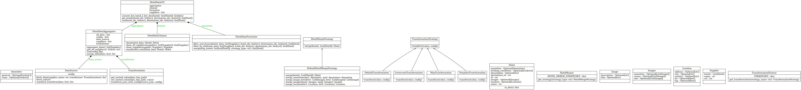
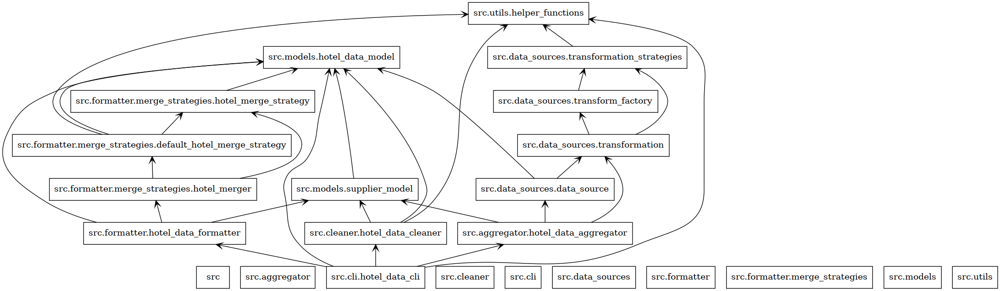

# roomlytic - A console application to collect and analyze hotel data from multiple suppliers

## Pre-requisites
- Python 3.10 (**not compatible** with Python 3.11+) and pip installed.

## Installation

1. Clone the repository
```bash
git clone https://github.com/DiriiMQ/roomlytic.git
```

2. Install the dependencies
```bash
cd roomlytic
pip install -r requirements.txt
```

## Usage

To run the application, you can use the `runner` script. The script takes two arguments:
  - A comma-separated list of hotel_ids
  - A comma-separated list of destination_ids

```bash
chmod +x runner
./runner <hotel_id_1,hotel_id_2,hotel_id_3> <destination_id_1,destination_id_2>
```

- If the hotel_ids or destination_ids are empty, you should pass "none" as the argument.
- If both hotel_ids and destination_ids are empty, the application will fetch all the data available.

To add new supplier, you can use script `supplier_manager`. Type `./supplier_manager --help` for more information. (This is a temporary solution, and the final version would have a config generator to automatical add new suppliers and its configurations)

Example:
```bash
./runner none none
```

The sample output is [here](sample/output.json).

## Application Structure

### Classes diagram



### Packages diagram



### Workflow explanation

1. The application starts by reading the configurations from the `suppliers.config.json` file. 
2. Fetch data from the suppliers and transform to a common format with `HotelDataAggregator`. 
3. Clean data with `HotelDataCleaner` with default strategy.
4. Save the data to the `output` directory in the JSON format.
5. Filter and format the data from the query with `HotelDataFormatter`. After filtering, the same hotels are mergered with `HotelDataMerger` with default strategy.
6. Output the data to the console.

### Key design patterns

- **Adapter** pattern is used to adapt the data from different suppliers to a common format. This allows the application to work with different suppliers without changing the core logic. I am also implementing the **ConfigGenerator** which will allow the application to automatically adapt to new suppliers by calling external Large Language Models (LLMs) to generate the configurations for the new suppliers.

- **Strategy** and **Factory Method** patterns are used to implement the `suppliers' merger` which allows the application to merge the data from multiple suppliers with different strategies. Currently, I have implemented default strategy which is to merge based on simple rules. In the future, we could implement more complex and effective strategies to merge the data easily. 

## Advantages

- **Scalability**: The application is designed to be scalable. It can easily adapt to new suppliers by using the `Adapter` pattern. The `ConfigGenerator` will allow the application to automatically adapt to new suppliers by calling external Large Language Models (LLMs) to generate the configurations for the new suppliers.
- **Flexibility**: The application is flexible. It can easily adapt to new requirements by changing the strategies in the `HotelDataMerger`, `HotelDataCleaner` and `HotelDataFormatter`.
- **Maintainability**: The application is easy to maintain. The code is well-structured and easy to understand. The classes are well-separated and follow the Single Responsibility Principle (SRP).

## Future improvements

- **ConfigGenerator**: Implement the `ConfigGenerator` to automatically adapt to new suppliers by calling external Large Language Models (LLMs) to generate the configurations for the new suppliers.

## Replit

[Run on Replit](https://replit.com/@pmquang22/roomlytic)

## License

This project is licensed under the MIT License - see the [LICENSE](LICENSE) file for details.
